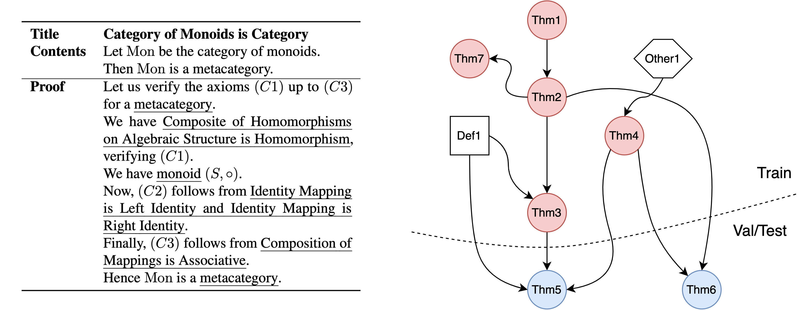

# NaturalProofs: Mathematical Theorem Proving in Natural Language

### Sean Welleck, Jiacheng Liu, Ronan Le Bras, Hannaneh Hajishirzi, Yejin Choi, Kyunghyun Cho

### [[Paper](https://cs.nyu.edu/~welleck/welleck2021naturalproofs.pdf), [Data/Code/Models](https://github.com/wellecks/naturalproofs)]

**Abstract**: Understanding and creating mathematics using natural mathematical language &mdash; the mixture of symbolic and natural language used by humans &mdash; is a challenging and important problem for driving progress in machine learning. As a step in this direction, we develop NaturalProofs, a multi-domain corpus of mathematical statements and their proofs, written in natural mathematical language. NaturalProofs unifies broad coverage, deep coverage, and low-resource mathematical sources, allowing for evaluating both in-distribution and zero-shot generalization. Using NaturalProofs, we benchmark strong neural methods on mathematical reference retrieval and generation tasks which test a system's ability to determine key results that appear in a proof. Large-scale sequence models show promise compared to classical information retrieval methods, yet their performance and out-of-domain generalization leave substantial room for improvement. NaturalProofs opens many avenues for research on challenging mathematical tasks.
 

